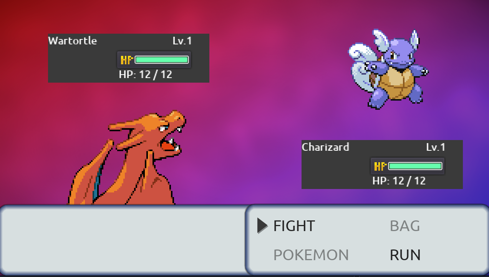

# Pokemon RPG mechanics

  
  

    <small> <i>Creation screen </i></small>
  

  
  

    <small> <i>Battle screen </i></small>
  

Base project for the tutorial series about [Godot RPG mechanics](https://youtube.com/playlist?list=PLaCq3HqKQR6pDwuJiPJDKxJjpcPwYV7gR) (Italian commentary).

## Simplifications

- Only 1st gen Pokemons
- Only 1 save file
- All pokemons use the Medium fast experience curve
- No sounds/ attack animations

The main objective of this project was exploring GDScript advanced features and not to create a replica of the Pokemon battle system.

## External resources

### Pokemon datasets

- ⭐️ CSV: https://github.com/veekun/pokedex/tree/master/pokedex/data/csv
- ⭐️ SQLite: https://github.com/decentralion/PokemonSQLTutorial
- https://gamefaqs.gamespot.com/gameboy/367023-pokemon-red-version/faqs/5770
- https://github.com/lgreski/pokemonData
- https://www.kaggle.com/abcsds/pokemon

### Tutorials

- GDQuest: [Godot Save Game Tutorial: Save and load using Resources](https://youtu.be/ML-hiNytIqE)
- JSON save file: https://docs.godotengine.org/en/stable/tutorials/io/saving_games.html

Godot `Resource`:

- [Resource Saver Flags](https://docs.godotengine.org/en/stable/classes/class_resourcesaver.html?#enumerations)

### Addons

https://makovwait.itch.io/imrpoved-resource-picker-for-godot

### Relevant Godot Pull Request

- [Add first-class custom resource support](https://github.com/godotengine/godot-proposals/issues/18)

### References

Gameplay video

- https://www.youtube.com/watch?v=UE9qsxyzZx4

Pokemon team builder:

- https://play.pokemonshowdown.com/teambuilder
